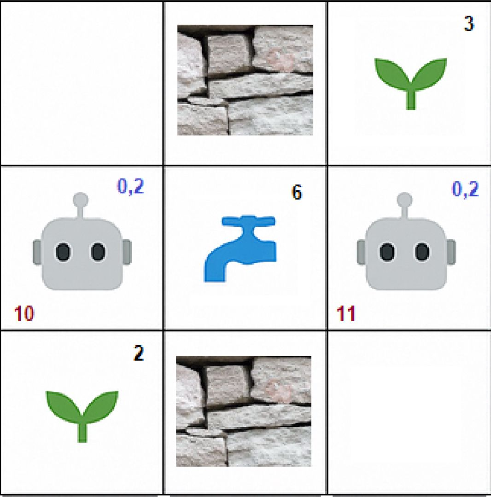

# 🌱🤖🚰 Watering Problem 
https://www.facebook.com/watch/?v=10155017112671901  
This project is an **AI-Agent** which has one goal: Finding the optimal way to water plants in the watering problem  
  
## 🤔 What Even is a Watering Problem? 
A watering problem consists of an $N\times M$ **grid**, which contatins **robots, plants, taps and walls**.  
🤖 Each robot has: 
1. 🚧  **capacity**: The maximal number of Water-Units it can hold at any given moment
2. 📦  **load**:  he current number of Water-Units the robot holds.
   
🌱 Each Plant has: 
1. 💦 **water_needed**: The number of Water-Units the plant needs in order to be fully saturated
   
🚰 Each Tap has:
1. 💦 **water_available**: The number of Water-Units the tap has left to giveֿ

  
### 📜 Rules:
1. Each step, only one robot is allowed to make a move: UP, DOWN, LEFT, RIGHT, LOAD, POUR
2. All robots begin with load = 0
3. A robot cannot move to a square which has a wall, another robot, or outside the boundaries of the grid
   
  
### Example of a watering problem:

  

  
## 🌟 What Even is an _Optimal_ Solution?
Excellent question!  
Before we discuss the strategies to solve the problem, we need to begin by defining what our goal even is.  
This agent is able to support these two types of goals:

### 💯 1. Water All of the Plants in the Garden
🎯 **This is the Planning part of the project**  
 
The goal of our agent is to water all plants in the garden.  
 
to find *A* path is pretty easy and can be calculated rather fast using the GBFS algorithm.
Actually, my algorithm gives a very good path in a very short time while using a very simple GBFS heuristic (The number of Water Units the plants still need plus the amount of Water Units the robots still need to load to reach that number)
 
#### 🤔 So What's the Catch?
The thing is, we don't want a "very good path".  
We want the OPTIMAL path. The path with the lowest number of steps.
  
Apparently, Calculating the optimal path, using the A* algorithm is a super difficult task.  
Why? 
  
Just think of how mamy different states are there. The robots can be can be in every square of the board, and for each one, the taps can be at different capacities, the plants can be in different need, and so on.
 
Spoiler: This huge State Space is too big to fit in our computers' memory.
